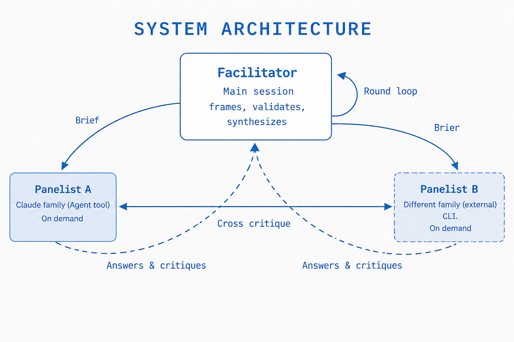

# adversarial-multi-model-review

Multi-model adversarial mutual review for **Cursor** — facilitator + panelists, rounds 0–3, synthesis. English only.



The facilitator (main session) distributes a self-contained brief. Panelists cross-critique each other and return answers and critiques. The facilitator synthesizes the result.

## Install

This package is a self-contained Cursor skill directory. Install to one or both locations:

| Location | Path pattern | Scope |
|---|---|---|
| User-level | `~/.cursor/skills/adversarial-multi-model-review/` | All Cursor projects |
| Project-level | `<repo>/.cursor/skills/adversarial-multi-model-review/` | One repository |

Copy or rsync **only** `SKILL.md`, `assets/`, and `references/` — not `README.md` or `scripts/`.

```bash
# From this package root:
PKG_ROOT="$(pwd)"
SKILL_FILES="SKILL.md assets references"

# User-level
mkdir -p "${HOME}/.cursor/skills/adversarial-multi-model-review"
rsync -av --delete ${SKILL_FILES} "${HOME}/.cursor/skills/adversarial-multi-model-review/"

# Project-level (set PROJECT_ROOT to your repo)
PROJECT_ROOT="/path/to/your/repo"
mkdir -p "${PROJECT_ROOT}/.cursor/skills/adversarial-multi-model-review"
rsync -av --delete ${SKILL_FILES} "${PROJECT_ROOT}/.cursor/skills/adversarial-multi-model-review/"
```

Or use the helper script (syncs user-level by default; pass project paths as arguments):

```bash
./scripts/sync-installs.sh
./scripts/sync-installs.sh /path/to/repo/.cursor/skills/adversarial-multi-model-review
```

## Usage

In any Cursor project:

- "Run adversarial-multi-model-review on this design"
- "Red-team this architecture decision"
- "Are you sure? Run a panel on this"

Or reference the `adversarial-multi-model-review` skill directly.

## Panelist tiers

1. **Tier 1** — Different model family via Cursor `Task` (`gemini-*`, `gpt-*`, …), or optional **Codex CLI**
2. **Tier 2** — Different Cursor models on `Task`
3. **Tier 3** — Same model, forced methodological divergence

**Claude Code:** optional **Antigravity CLI** (`agy -p`) or Codex — see `references/claude-code-dispatch.md`. Not recommended in Cursor (use Task+Gemini instead).

Default: **2 panelists × 3 rounds**.

## Codex CLI (optional)

```bash
codex --version
codex login          # once, in a real terminal
codex exec "prompt" </dev/null
```

Codex is optional. Fall back to Tier 2/3 if unavailable.

## Antigravity CLI (Claude Code, optional)

For **Claude Code** hosts without Cursor Task. **Not recommended in Cursor** — use Task with `gemini-*` instead.

One-time auth in a **human terminal** (never from an agent shell), then `agy --mode plan -p "prompt"`. See `references/claude-code-dispatch.md`.