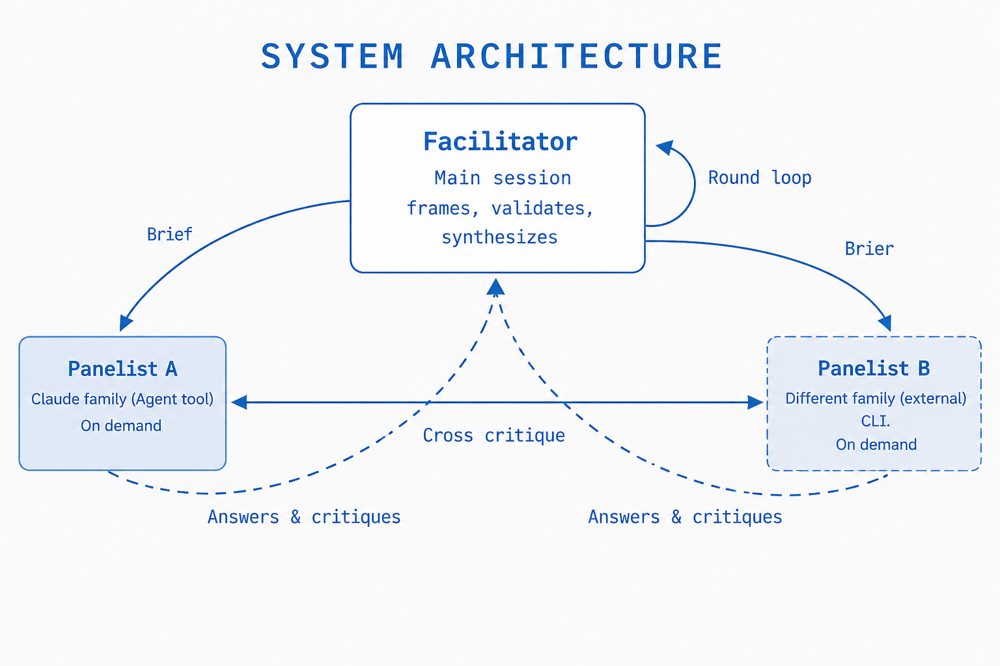
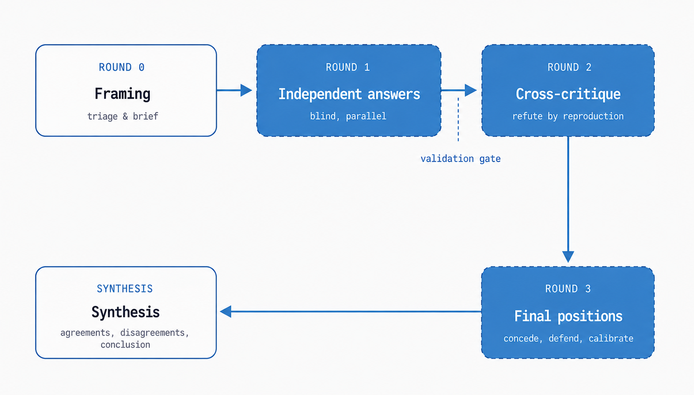

# Protocol



The facilitator (main session) distributes a self-contained brief. Panelists cross-critique each other and return answers and critiques. The facilitator synthesizes the result.



White boxes = facilitator. Purple boxes = panelists.

## Round 0 — Frame and triage (facilitator only)

1. **Decide whether the panel is worth it.**
   - Low-stakes or justifiably confident → answer directly; offer the panel as an option.
   - Consequential AND contested or verifiable → run the full panel.
   - If the user explicitly asked for a panel → run it regardless of your confidence (triage trap defense).
   - For consequential questions, let stakes — not felt certainty — decide.

2. **Write a self-contained brief.** Panelists see none of the conversation. Include:
   - Exact question
   - Needed context and constraints
   - Deliverable format
   - Instruction: separate facts from speculation; attach confidence and a **falsification condition** to each key claim

Falsification conditions must be concrete and checkable ("fails on input X", "contradicted by source Y"). Generic conditions ("if evidence emerges to the contrary") are calibration theater and count as missing.

## Round 1 — Independent answers (parallel)

- Launch all panelists in parallel with the brief.
- Instruction: final message is the debate record; no preamble.
- No panelist sees another's output.

**Validation gate (mandatory):** See [validation-gate.md](validation-gate.md).

## Round 2 — Cross-critique (parallel)

Give each panelist the OTHER panelists' Round 1 answers:

- Quote specific claims and attack them: factual errors, weak evidence, logical leaps, missing alternatives, unstated assumptions.
- For verifiable claims, refute by reproduction: run code, recompute, check sources.
- No agreement padding, no summaries, no praise. Concessions need reasons; so do attacks.
- End with at most a short list of genuine agreements.
- Add: "You disagree with at least one central claim; find it."

## Round 3 — Final positions (parallel)

Give each panelist the critiques of their own answer:

- Concede what was rightly attacked (with reasons, not socially).
- Defend what survives with reasons.
- State residual uncertainty and calibrated confidence with a falsification condition.
- An unexplained full reversal is a sycophancy flag — ask for grounds before accepting.

**Cost shortcut:** For cheap questions with 2 panelists, merge Rounds 2+3 into one "critique, then restate your final position" round.

## Synthesis (facilitator)

Produce user-facing output in this shape:

```markdown
## Agreements
What panelists converged on, with the strongest single argument —
and whether convergence is strong evidence (heterogeneous panel) or weak
(same-family panel, shared blind spots possible).

## Live disagreements
Each unresolved disagreement as: who claims what / on what evidence / your
adjudication with reasons — or explicit "unresolvable with available evidence"
plus what evidence would resolve it. Distinguish real disagreements from
taxonomy differences. Weigh by evidence strength; do not present false balance
when one side has reproducible evidence and the other has intuition.

## Calibrated conclusion
The answer, confidence, what would change it, minority opinions worth preserving,
which critiques you accepted/rejected and why (audit trail), and which
heterogeneity tier the panel actually ran at (verified, not intended).
```

Never present synthesis as unanimous when it wasn't. Never cite the panel as authority for a view that is actually your own.

## Default scale

- **2 panelists × 3 rounds** for routine use.
- Scale to 3–4 panelists only when the user asks for thoroughness; cost grows as panelists × rounds.
